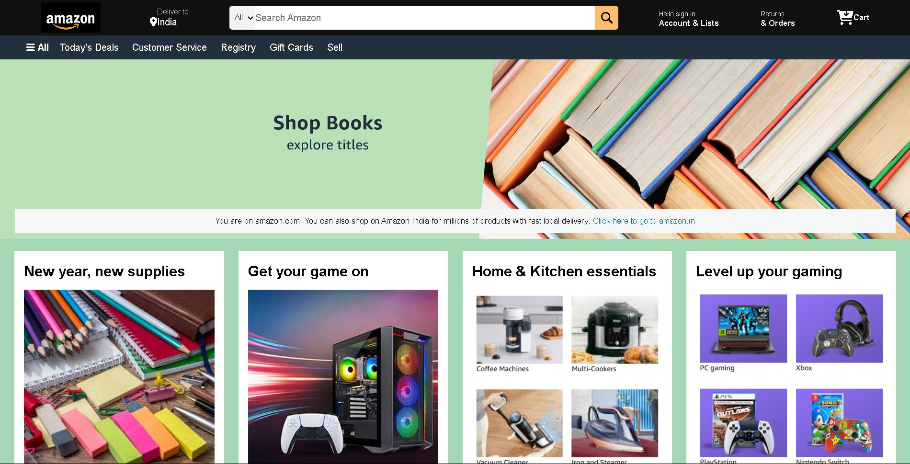
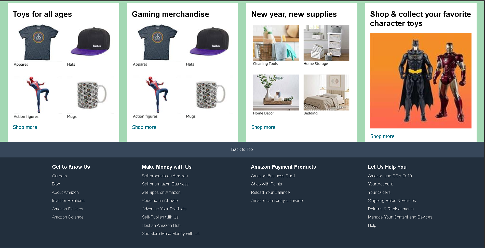

# Amazon-Frontend-Clone
# 🛍️ Amazon Clone - Frontend (HTML & CSS)

This project is a **frontend-only clone** of the Amazon.com homepage, built using **HTML5** and **CSS3**. It mimics the visual appearance and layout of the original Amazon website for practice and learning purposes.



---

## 🔗 Live Preview

👉 [GitHub Repository](https://github.com/OmkarYelsange/Amazon-Frontend-Clone)

> *You can download and open `index.html` in your browser to see the result locally.*

---

## 🔧 Technologies Used

- ✅ HTML5
- ✅ CSS3 (Flexbox, Grid, Media Queries)
- ✅ Google Fonts 
- ✅ Font Awesome 

---

## 📁 Folder Structure

```
Amazon Clone Frontend Project/
│
├── assets/
│ ├── page1.png
│ ├── page2.png
├── 1.png
├── 2.png
├── 3.png
├── 4.png
├── 5.png
├── index.html
├── style.css
└── README.md

```

---

## ✨ Features

- ✅ Amazon-style navbar with logo, search bar, location, and cart
- ✅ Product section with responsive grid layout
- ✅ Promotional banners and offers
- ✅ Structured and readable HTML/CSS code
- ✅ Responsive design for mobile and tablet *(if implemented)*

---

## 🚀 Getting Started

Follow these steps to view the project locally:

1. **Clone the Repository**

   ```bash
   git clone https://github.com/OmkarYelsange/Amazon-Frontend-Clone.git

2. **cd Amazon-Frontend-Clone**
3. **start index.html**

📘 Learning Goals
🔹 Practice cloning real-world UIs

🔹 Strengthen HTML & CSS layout skills

🔹 Understand how e-commerce homepages are structured

⚠️ Disclaimer
This project is only for educational purposes.
It is not affiliated with or endorsed by Amazon.
All logos and trademarks belong to their respective owners.

✨ Created by Omkar Yelsange
